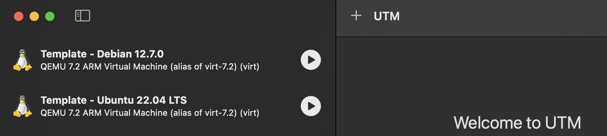
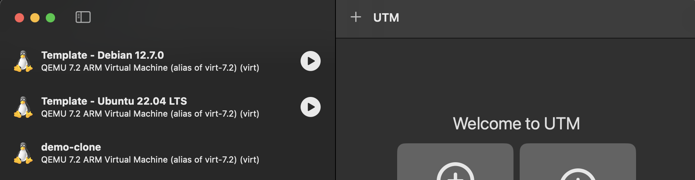

# UTMultiply
Easy UTM Cloning of VMs.

Consider you have set up template VMs in UTM, you can easily clone them using this script which takes care of MAC randomization, and configuring the `~/.ssh/config` file so you can immediately connect. The script is not bullet proof by any standards, and is somewhat opinionated. See [my blog post on Template setups](https://lambda-m.nl/blog/posts/utm-templates/) and usage.



```console
maarten@Maartens-MacBook-Pro UTMultiply % ./utmultiply.sh
Fetching list of Template VMs... [Done]

Select Template:
   1. Template - Debian 12.7.0
   2. Template - Ubuntu 22.04 LTS


Please enter a number [Default: 1]: 2
You selected: Template - Ubuntu 22.04 LTS
Please enter a new hostname for Template - Ubuntu 22.04 LTS: demo-clone
Hostname is valid: demo-clone
Cloning Template - Ubuntu 22.04 LTS as demo-clone...[Done]
Randomizing MAC address...[Done]
Starting VM...[Done]
Retrieving IP address...[Done]
Setting hostname on the VM...[Done]
Updating SSH config...[Done]

Summary:
  VM Name     : demo-clone
  IP Address  : 192.168.64.21
  SSH Command : ssh demo-clone
```

You now have a running VM clone:

and you can directly login via SSH by name:

```console
maarten@Maartens-MacBook-Pro UTMultiply % ssh demo-clone
Warning: Permanently added '192.168.64.21' (ED25519) to the list of known hosts.
Welcome to Ubuntu 22.04.5 LTS (GNU/Linux 5.15.0-124-generic aarch64)

 * Documentation:  https://help.ubuntu.com
 * Management:     https://landscape.canonical.com
 * Support:        https://ubuntu.com/pro

 System information as of Sun Oct 27 10:17:53 AM UTC 2024

  System load:             0.08
  Usage of /:              23.4% of 29.82GB
  Memory usage:            2%
  Swap usage:              0%
  Processes:               136
  Users logged in:         0
  IPv4 address for enp0s1: 192.168.64.21
  IPv6 address for enp0s1: fda8:ff04:b4a0:e018:5405:daff:fe60:20a2


Expanded Security Maintenance for Applications is not enabled.

0 updates can be applied immediately.

Enable ESM Apps to receive additional future security updates.
See https://ubuntu.com/esm or run: sudo pro status

New release '24.04.1 LTS' available.
Run 'do-release-upgrade' to upgrade to it.


Last login: Sun Oct 27 07:36:17 2024
maarten@demo-clone:~$
logout
Connection to 192.168.64.21 closed.
maarten@Maartens-MacBook-Pro UTMultiply %
```

